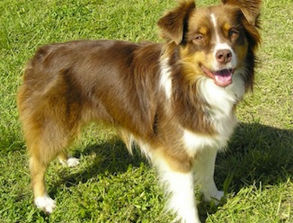

# Animals Image Classifier

The repository is inspired by YouTube video [Build a TensorFlow Image Classifier in 5 Min](https://www.youtube.com/watch?v=QfNvhPx5Px8) with [CodeLab](https://codelabs.developers.google.com/codelabs/tensorflow-for-poets/index.html) instructions.

Currently supports 4 type of animals: cat, dog, monkey, squirrel.


## Run Docker container image (and link TensorFlow docker image to dataset folder)
When starting docker container on Mac, bind the volumn `/tf_files`:

```
$ docker run -it -v $HOME/tf_files:/tf_files gcr.io/tensorflow/tensorflow:latest-devel
```

## Retrain the Model (Run TensorFlow training script)
Make sure the that the images has been labeled (categorized into different folders with the folder names as labels)
Like the following:

```
tf_files
|--animals
    |--cat
    |--dog
    |--monkey
    |--squirrel
```

In docker container command line, in `/tensorflow` directory run the following command:
```
$ python tensorflow/examples/image_retraining/retrain.py \
--bottleneck_dir=/tf_files/bottlenecks \
--how_many_training_steps 500 \
--model_dir=/tf_files/inception \
--output_graph=/tf_files/retrained_graph.pb \
--output_labels=/tf_files/retrained_labels.txt \
--image_dir /tf_files/animals
```

## Test the Labelling
Put test images in `/tf_files/test/` folder, then in docker command line, use the follow command:

```
$ python /tf_files/label_image.py /tf_files/test/basque-shepherd-dog.jpg
```

>"basque-shepherd-dog.jpg" is the file name of image

**Test Image**



**Screenshot of Result**


## Reference

- [Google CodeLab: TensorFlow For Poets](https://codelabs.developers.google.com/codelabs/tensorflow-for-poets/index.html)
- [Google CodeLab: TensorFlow and deep learning, without a PhD](https://codelabs.developers.google.com/codelabs/cloud-tensorflow-mnist/index.html)
